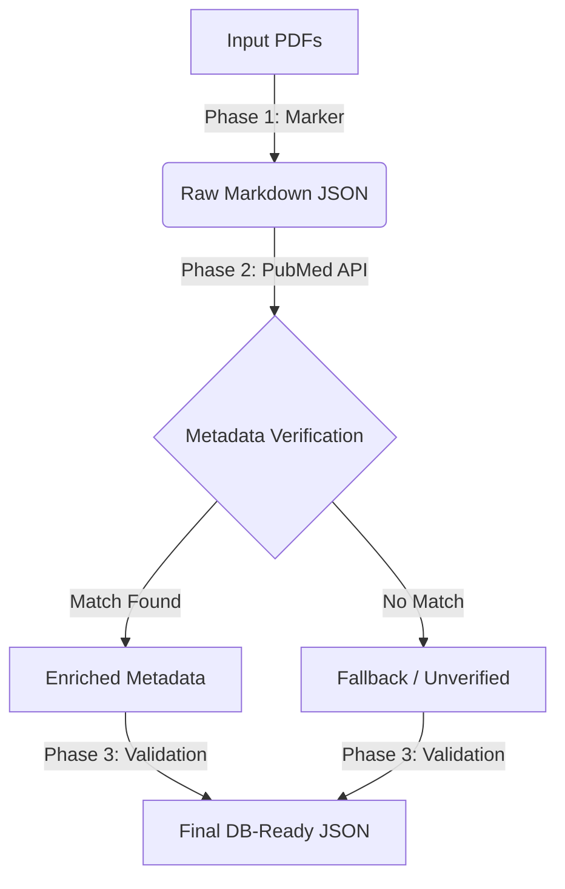

#  Data Extraction Pipeline with Marker

A robust, production-ready ETL pipeline designed to convert complex clinical guideline PDFs (ASCO) into structured, database-ready JSON. 

This project leverages **Marker (v1.0+)** for state-of-the-art PDF-to-Markdown conversion and validates metadata against the **PubMed API** to ensure high-fidelity data suitable for RAG (Retrieval-Augmented Generation) systems in healthcare.

## Why Marker?

Traditional PDF parsers (like PyMuPDF or pypdf) often output "soup" text—losing headers, list structures, and table layouts. This is critical in oncology guidelines where a number inside a table cell dictates patient care.

This pipeline uses **[Marker](https://github.com/VikParuchuri/marker)** because it:
* **Preserves Structure**: Accurately converts PDFs to Markdown, maintaining headers, lists, and complex tables.
* **Deep Learning Powered**: Uses OCR and layout analysis models to handle multi-column medical layouts.
* **Math & Equations**: Correctly renders mathematical formulas often found in dosage guidelines.

## Workflow

The pipeline operates in a linear, checkpointed workflow to ensure data integrity.

## Features
**Phase 1: Extraction (GPU-Accelerated)**

    Converts PDF to Markdown using Marker v1.0+.

    Medical Mode: Configured with batch_multiplier=1 to prioritize OCR accuracy over speed (preventing symbol hallucinations like ± becoming 6).

    Extracts tentative metadata (DOI/Title) from the raw PDF.

**Phase 2: Verification**

    Queries the PubMed API to verify titles and DOIs.

    Enriches data with authoritative citations, publication years, and official links.

**Phase 3: Validation & Assembly**

    Validates data against a strict Pydantic schema.

    Outputs one JSON per document containing the verified metadata and clean corpus.

## How to Run

Place your PDF files in the data/raw/ directory.

#### Step 1: Extract Text & Structure (Marker)
#### Output: data/marker_outputs/
python asco_marker_extraction.py

#### Step 2: Verify & Enrich (PubMed)
#### Output: data/processed/
python asco_pubmed_enrichment.py

## License

This project is licensed under the MIT License. (LICENSE.txt) 
